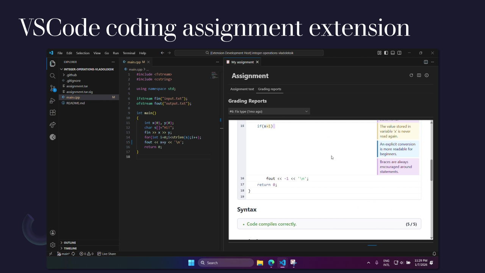
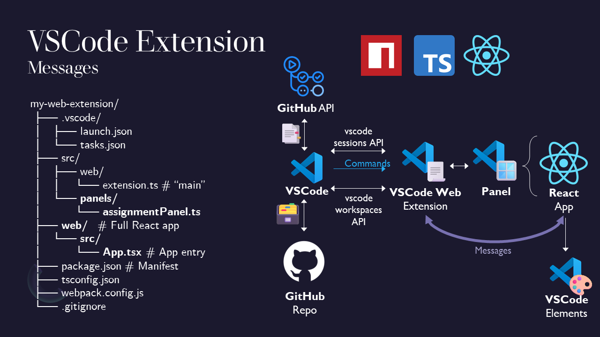

# GitHub Classroom Assignment Viewer

A VS Code Web extension that helps students view feedback produced by GitHub Actions runs for compatible GitHub Classroom assignments. The extension shows attempts for assignments in student repositories and displays grades, attempt numbers, and detailed run reports inside VS Code.

## Features

*   **View Action Reports:** Access and view detailed reports generated as artifacts from GitHub Actions workflow runs.
*   **Check Grades:** Quickly see the grade assigned to a submission.
*   **Track Attempts:** If applicable, view the attempt number for each submission.

## Who This Helps

- **Teachers / TAs:** Quickly inspect multiple student reports, check grades, and review attempted submissions without leaving VS Code.
- **Students:** Preview feedback from automated tests and graders produced by GitHub Actions after pushing assignments.

## Requirements

- A GitHub account with access to the student repositories (instructor/maintainer or student depending on use).
- Assignments configured to run GitHub Actions that publish report artifacts (HTML, JSON or text).

## For students
### Installation

1. Install the extension from the VS Code marketplace.
2. Ensure you have network access, are logged in to GitHub and that you have access to the assignment repository.

### Configuration

- Authentication: The extension requires a GitHub token or OAuth flow to access private repository artifacts. Follow the extension's authentication prompt when first opened.
- Repository selection: Use the UI to point the extension at a specific organization, classroom repo, or individual student repository.

When opened in a repository context, the extension will automatically list recent workflow runs and their artifacts. You can filter runs by branch, commit message, or date to find specific submissions.

### Using the Extension — Quick Steps

1. Open the extension panel in VS Code and sign in to GitHub when prompted.
2. Choose the repository (or organization/classroom bundle) you want to inspect.
3. Select a workflow run from the list of recent runs for the assignment.
4. Click an artifact to preview the generated report; view grade and attempt metadata beside the preview.

## For teachers / TAs
### Tips
Suggested workflow for instructors:

1. Configure your assignment workflow to run tests and produce an artifact (e.g., `report.html`).
2. Use the extension to scan results and export or copy feedback as needed.

Notes:
- The extension shows artifacts produced by workflow runs — ensure your CI publishes artifacts using `actions/upload-artifact` or similar.

### Troubleshooting

- No artifacts shown: Confirm the action published artifacts and you have repository access.
- Authentication issues: Reconnect your GitHub account or re-authorize the extension.
- Missing attempt: Ensure your workflow run triggers are set correctly (on push).

If you still have trouble, open an issue on the repository and include the workflow name, a run ID, and any error messages.

### Contributing

Contributions are welcome. Please open PRs for bug fixes, new features, or UI improvements. When contributing, include:

- A short description of the change.
- Any relevant screenshots for UI updates.
- Tests for new behavior where appropriate.

### How the extension works

  Extension architecture diagram and file structure

The extension follows an MVC-like architecture: `src/web/extension.ts` (and `src/panels/assignmentPanel.ts`) act as the controller (authentication, GitHub API calls, and webview wiring), the React app in `web/src/App.tsx` is the view (UI and components), and data types such as `web/src/GradingRun.ts` serve as lightweight models/DTOs. See the comments in `src/web/extension.ts` and `web/src/App.tsx` for implementation details and development notes.
The communication between the extension and the webview is done through VSCode's `postMessage` API, allowing for a responsive and interactive user experience.
The controller handles authentication, API calls to GitHub to fetch workflow runs and artifacts, and passes this data to the React view for rendering. The view displays the list of runs, their grades, attempt numbers, and allows users to click on artifacts to preview them directly within VS Code.

## Extension Settings

This extension currently does not require any specific VS Code settings. Future updates may include settings for custom report parsing or repository filtering.

## Known Issues
There are currently no known issues. Please report any bugs or feature requests on the project's GitHub repository.

## Release Notes

### 1.0.0

- Initial release: view GitHub Actions reports, grades, and attempt metadata inside VS Code.

## License

This project is provided under the terms in the repository (check the project root for a license file).

